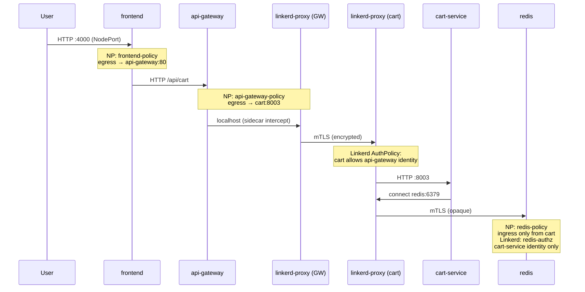
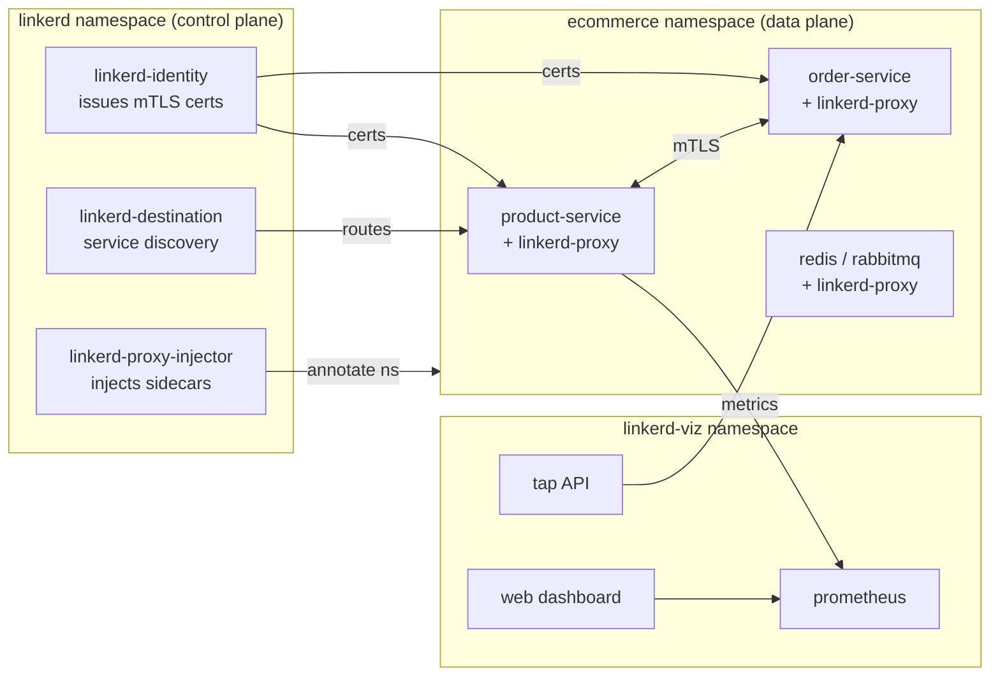
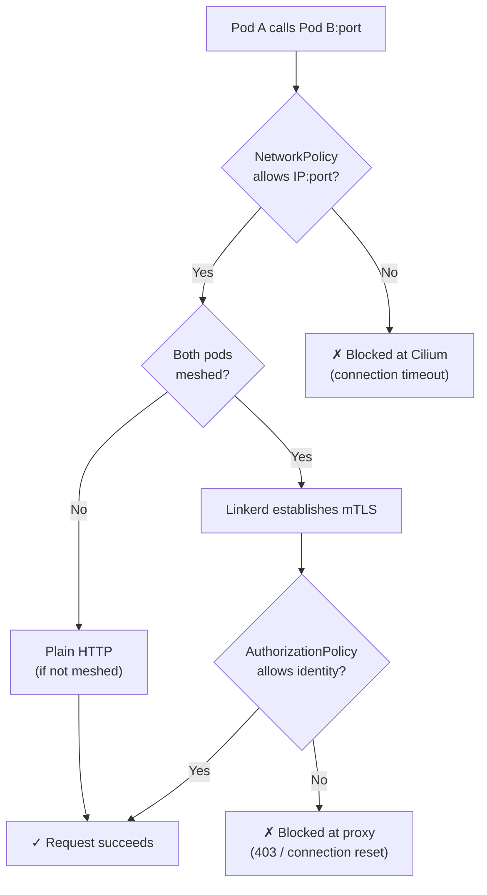

# Network Policy + Service Mesh — Visual Map & Learning Guide

Visual reference for how **Kubernetes NetworkPolicies** (L3/L4) and **Linkerd** (L7 + mTLS) work together in `k8s-networking-test/`.

Deploy first: see [instruction.md](./instruction.md).

---

## 1. Two security layers at a glance

```
                         ┌─────────────────────────────────────┐
                         │           EXTERNAL TRAFFIC            │
                         └──────────────────┬──────────────────┘
                                            │
    ┌───────────────────────────────────────▼───────────────────────────────────────┐
    │  LAYER 1 — Kubernetes NetworkPolicy (Cilium enforces)                         │
    │  • Default deny all pods in `ecommerce`                                       │
    │  • Allow by: pod labels, namespace, port, CIDR                                │
    │  • Files: networking/policies/*.yaml                                          │
    └───────────────────────────────────────┬───────────────────────────────────────┘
                                            │
    ┌───────────────────────────────────────▼───────────────────────────────────────┐
    │  LAYER 2 — Linkerd Service Mesh                                               │
    │  • Sidecar proxy on every meshed pod                                            │
    │  • Automatic mTLS between meshed services                                       │
    │  • L7 AuthorizationPolicy (who can call whom, by ServiceAccount identity)       │
    │  • ServiceProfile (timeouts, retries, per-route metrics)                        │
    │  • Files: networking/linkerd/**                                               │
    └───────────────────────────────────────┬───────────────────────────────────────┘
                                            │
                         ┌──────────────────▼──────────────────┐
                         │   APP CONTAINERS (microservices)    │
                         └─────────────────────────────────────┘
```

| Question | NetworkPolicy answers | Linkerd answers |
|----------|----------------------|-----------------|
| Can pod A reach pod B on port X? | Yes / No (IP + port) | — |
| Is traffic encrypted? | No | Yes (mTLS) |
| Which **identity** is calling? | Only pod labels | ServiceAccount SPIFFE identity |
| HTTP route timeouts / retries? | No | Yes (ServiceProfile) |
| Live traffic inspection? | Cilium Hubble (optional) | `linkerd viz tap` |

---

## 2. Policy file → what it protects

```mermaid
flowchart TB
    subgraph NP["NetworkPolicy files (networking/policies/)"]
        P00["00-default-deny.yaml<br/>deny all + DNS"]
        P01["01-api-gateway.yaml"]
        P02["02-services.yaml<br/>6 microservices"]
        P03["03-infrastructure.yaml<br/>Redis, RabbitMQ, CNPG"]
        P04["04-cross-namespace.yaml<br/>Frontend, Vault, ESO"]
        P05["05-seed-job.yaml"]
        P06["06-linkerd-proxy.yaml<br/>proxy port 4143"]
    end

    subgraph MESH["Linkerd files (networking/linkerd/)"]
        SP["service-profiles/all-services.yaml"]
        SV["authorization/servers.yaml"]
        AP["authorization/policies.yaml"]
    end

    P00 --> ALL["All pods in ecommerce"]
    P01 --> GW["api-gateway"]
    P02 --> MS["product, user, cart,<br/>order, payment, notification"]
    P03 --> INF["redis, rabbitmq, postgres pods"]
    P04 --> EXT["frontend, vault egress,<br/>prometheus scrape"]
    P05 --> SEED["seed-data-job"]
    P06 --> PROXY["meshed pods + linkerd CP"]

    SP --> ROUTES["Per-route metrics,<br/>timeouts, retries"]
    SV --> PORTS["Protected ports<br/>8001–8006, 6379, 5672"]
    AP --> AUTHZ["mTLS identity checks"]
```



| File | Kubernetes resource | Applies to | Key rule |
|------|---------------------|------------|----------|
| `00-default-deny.yaml` | NetworkPolicy ×2 | All pods | Deny all ingress/egress; allow DNS :53 |
| `01-api-gateway.yaml` | NetworkPolicy | `app: api-gateway` | Ingress :80 from anywhere; egress to all 6 services |
| `02-services.yaml` | NetworkPolicy ×6 | Each microservice | Ingress/egress per connectivity matrix |
| `03-infrastructure.yaml` | NetworkPolicy ×3 | CNPG, Redis, RabbitMQ | DB only from owning service; Redis only from cart |
| `04-cross-namespace.yaml` | NetworkPolicy ×4 | Frontend, all pods | Frontend→GW; egress to vault/eso; prom scrape |
| `05-seed-job.yaml` | NetworkPolicy | `app: seed-data-job` | Egress to api-gateway :80 |
| `06-linkerd-proxy.yaml` | NetworkPolicy ×2 | All pods | Ingress :4143/:4191; egress to linkerd namespaces |
| `linkerd/.../servers.yaml` | Server ×9 | Each service + redis + rabbitmq | Defines protected port + protocol |
| `linkerd/.../policies.yaml` | AuthorizationPolicy + MeshTLSAuthentication | Per Server | Which SA identity may connect |
| `linkerd/.../all-services.yaml` | ServiceProfile ×6 | HTTP microservices | Route timeouts, retry flags |

---

## 3. Traffic flow (with both layers active)



**Inside each meshed pod:**

```
┌─────────────────────────────────────────┐
│  Pod: cart-service                      │
│  ┌─────────────┐    ┌─────────────────┐ │
│  │ cart-service│───►│ linkerd-proxy   │ │
│  │  container  │    │  (sidecar)      │ │
│  └─────────────┘    └────────┬────────┘ │
│                              │          │
└──────────────────────────────┼──────────┘
                               │ mTLS + NP-checked egress
                               ▼
                    redis / user-service / product-service
```

---

## 4. Service connectivity matrix

**Legend:** NP = NetworkPolicy allows | LZ = Linkerd AuthorizationPolicy allows

| From ↓ / To → | product | user | cart | order | payment | notif | redis | rabbitmq | *-rw DB |
|---------------|:-------:|:----:|:----:|:-----:|:-------:|:-----:|:-----:|:--------:|:-------:|
| **api-gateway** | NP+LZ | NP+LZ | NP+LZ | NP+LZ | NP+LZ | NP+LZ | — | — | — |
| **cart-service** | NP+LZ | NP+LZ | — | — | — | — | NP+LZ | — | — |
| **order-service** | NP+LZ | — | NP+LZ | — | — | — | — | NP+LZ | NP |
| **payment-service** | — | — | — | NP+LZ | — | — | — | — | NP |
| **notification** | — | — | — | — | — | — | — | NP+LZ | — |
| **frontend** | — | — | — | — | — | — | — | — | — |
| **frontend → api-gateway** | NP | — | — | — | — | — | — | — | — |

Individual DB access (NetworkPolicy only — Postgres not meshed):

| Service | CNPG cluster | Port |
|---------|--------------|------|
| product-service | `products` | 5432 |
| user-service | `users` | 5432 |
| order-service | `orders` | 5432 |
| payment-service | `payments` | 5432 |

---

## 5. Linkerd component map



| Component | Where to look | What it tells you |
|-----------|---------------|-------------------|
| `linkerd-proxy` container | `kubectl get pods -n ecommerce` | Sidecar injected (2/2 containers) |
| `linkerd-identity` | `kubectl logs -n linkerd deploy/linkerd-identity` | Certificate issuance issues |
| `linkerd-destination` | `linkerd check` | Service discovery health |
| ServiceProfile | `kubectl get sp -n ecommerce` | Route-level config loaded |
| Server | `kubectl get servers -n ecommerce` | Which ports are L7-protected |
| AuthorizationPolicy | `kubectl get authorizationpolicies -n ecommerce` | Who may call each Server |
| Viz dashboard | `linkerd viz dashboard` | Golden metrics, topology |

---

## 6. Identity mapping (critical for mesh auth)

Linkerd identifies callers by **ServiceAccount name**, not deployment name.

| Workload | ServiceAccount | Linkerd identity string |
|----------|----------------|---------------------------|
| api-gateway | `api-gateway` | `api-gateway.ecommerce.serviceaccount.identity.linkerd.cluster.local` |
| product-service | `product-service` | `product-service.ecommerce.serviceaccount.identity.linkerd.cluster.local` |
| cart-service | `cart-service` | `cart-service.ecommerce.serviceaccount.identity.linkerd.cluster.local` |
| order-service | `order-service` | `order-service.ecommerce.serviceaccount.identity.linkerd.cluster.local` |
| payment-service | `payment-service` | `payment-service.ecommerce.serviceaccount.identity.linkerd.cluster.local` |
| notification-service | `notification-service` | `notification-service.ecommerce.serviceaccount.identity.linkerd.cluster.local` |
| redis | `redis` | `redis.ecommerce.serviceaccount.identity.linkerd.cluster.local` |
| rabbitmq | `rabbitmq` | `rabbitmq.ecommerce.serviceaccount.identity.linkerd.cluster.local` |

Verify:

```bash
kubectl get sa -n ecommerce
linkerd viz edges deploy -n ecommerce -o wide   # SECURED column = mTLS active
```

---

## 7. What to look at — service mesh observability checklist

After `./deploy-all.sh`, walk through these in order. Each step builds understanding of a different mesh concept.

### A. Confirm the mesh is alive

```bash
linkerd check                          # control plane healthy
linkerd check --proxy -n ecommerce     # all proxies healthy
kubectl get pods -n ecommerce          # 2/2 READY on meshed workloads
```

**Look for:** every app pod shows `2/2` (app + `linkerd-proxy`). RabbitMQ StatefulSet should also be `2/2`.

---

### B. See mTLS in action

```bash
linkerd viz edges deploy -n ecommerce -o wide
```

**Look for:**

| Column | Meaning |
|--------|---------|
| `SECURED` | `√` = traffic encrypted with mTLS |
| `SRC` / `DST` | Which services talk to each other |
| `CLIENT` / `SERVER` | Port-level connection |

Generate traffic first so edges appear:

```bash
curl -s http://localhost:9080/health
curl -s http://localhost:9080/api/products
```

---

### C. Golden metrics (the core mesh value)

```bash
linkerd viz stat deploy -n ecommerce
linkerd viz stat deploy -n ecommerce --from deploy/api-gateway
```

**Look for:**

| Metric | What it means |
|--------|---------------|
| `SUCCESS` | % of successful responses (2xx/3xx) |
| `RPS` | Requests per second |
| `LATENCY_P50/95/99` | Response time percentiles |

**Try:** hit a slow endpoint, re-run stat — latency columns update without changing app code.

---

### D. Live request tap (best way to "see" the mesh)

```bash
linkerd viz tap deploy/order-service -n ecommerce
# in another terminal:
curl -s http://localhost:9080/api/orders -H "Authorization: Bearer <token>"
```

**Look for in tap output:**

| Field | Meaning |
|-------|---------|
| `:method`, `:path` | HTTP route |
| `tls=true` | Request was mTLS |
| `src` / `dst` | Source and destination identities |
| `status` | HTTP status code |

---

### E. Top (real-time RPS per route)

```bash
linkerd viz top deploy/api-gateway -n ecommerce
```

**Look for:** which `/api/*` routes get traffic and their live RPS/latency.

---

### F. ServiceProfile effect

```bash
kubectl get serviceprofiles -n ecommerce
linkerd viz routes deploy/order-service -n ecommerce
```

**Look for:** named routes like `POST /api/orders` with configured timeouts. Order creation has `isRetryable: false` — mesh will not auto-retry it.

---

### G. Authorization policies (L7 firewall)

```bash
kubectl get servers,authorizationpolicies,meshtlsauthentications -n ecommerce
```

**Look for:** each `Server` has a matching `AuthorizationPolicy` listing allowed identities.

---

### H. Linkerd dashboard (visual learning)

```bash
linkerd viz dashboard
```

In the UI, explore:

1. **Deployments** — success rate, latency per service
2. **Routes** — per-path breakdown (needs ServiceProfile)
3. **Tap** — live request stream
4. **Topology** — service graph with mTLS edges

---

## 8. Hands-on test lab

Run these after full deploy. Purpose: feel the difference between NetworkPolicy and Linkerd.

### Lab 1 — NetworkPolicy blocks L3 (mesh irrelevant)

```bash
# ALLOWED: cart → redis (NP + Linkerd auth)
kubectl exec -n ecommerce deploy/cart-service -c cart-service -- nc -zv redis 6379

# BLOCKED: cart → payments DB (no NP rule)
kubectl exec -n ecommerce deploy/cart-service -c cart-service -- nc -zv payments-rw 5432 -w 2
# Expected: timeout / connection refused
```

**Lesson:** NetworkPolicy is a coarse IP/port firewall. No policy = no connection, even with mTLS.

---

### Lab 2 — Linkerd auth blocks L7 (NP might allow)

```bash
# ALLOWED: cart → product (both NP and Linkerd)
kubectl exec -n ecommerce deploy/cart-service -c cart-service -- \
  curl -sf http://product-service:8001/health && echo OK

# BLOCKED: notification → product (NP allows pod traffic; Linkerd auth denies)
kubectl exec -n ecommerce deploy/notification-service -c notification-service -- \
  curl -sf --max-time 3 http://product-service:8001/health || echo "blocked by Linkerd auth"
```

**Lesson:** Linkerd AuthorizationPolicy adds identity-aware rules on top of NetworkPolicy.

---

### Lab 3 — mTLS verification

```bash
# Before mesh: plain HTTP between pods
# After mesh: tap shows tls=true

linkerd viz tap deploy/product-service -n ecommerce --path /health &
curl -s http://localhost:9080/api/health/product-service
```

**Look for:** `tls=true` and identity fields in tap output.

---

### Lab 4 — Compare with policies disabled

```bash
# Temporarily remove Linkerd auth (observe difference)
kubectl delete authorizationpolicies -n ecommerce --all
kubectl exec -n ecommerce deploy/notification-service -c notification-service -- \
  curl -sf http://product-service:8001/health && echo "now allowed without authz"

# Restore
kubectl apply -f networking/linkerd/authorization/policies.yaml
```

**Lesson:** Without AuthorizationPolicy, mTLS still encrypts but any meshed identity can call any meshed server.

---

### Lab 5 — End-to-end user flow + mesh metrics

```bash
# 1. Open dashboard
linkerd viz dashboard &

# 2. Browse the app
open http://localhost:4000

# 3. Watch stats update
watch -n2 'linkerd viz stat deploy -n ecommerce'
```

**Look for:** `api-gateway` RPS increases; downstream services show latency chains.

---

### Lab 6 — Cilium Hubble (network layer view)

```bash
cilium hubble ui
# or
hubble observe --namespace ecommerce --protocol tcp
```

**Look for:** allowed/blocked flows at L3/L4 — complements Linkerd's L7 view.

---

## 9. NP vs Linkerd — when each one blocks traffic



---

## 10. Quick reference commands

```bash
# --- NetworkPolicy ---
kubectl get networkpolicies -n ecommerce
kubectl describe networkpolicy cart-service-policy -n ecommerce

# --- Linkerd health ---
linkerd check
linkerd check --proxy -n ecommerce

# --- Mesh observability ---
linkerd viz stat deploy -n ecommerce
linkerd viz edges deploy -n ecommerce -o wide
linkerd viz top deploy/api-gateway -n ecommerce
linkerd viz tap deploy/cart-service -n ecommerce
linkerd viz routes deploy/order-service -n ecommerce
linkerd viz dashboard

# --- Mesh config ---
kubectl get serviceprofiles,servers,authorizationpolicies -n ecommerce

# --- Debug proxy ---
kubectl logs -n ecommerce deploy/order-service -c linkerd-proxy --tail=50
linkerd diagnostics proxy-metrics -n ecommerce deploy/order-service
```

---

## 11. Learning path (recommended order)

| Step | Focus | Time |
|------|-------|------|
| 1 | Deploy with `./deploy-all.sh` | 20 min |
| 2 | Run Lab 1 (NetworkPolicy) | 10 min |
| 3 | `linkerd check` + confirm 2/2 pods | 5 min |
| 4 | `linkerd viz edges` — understand mTLS | 10 min |
| 5 | `linkerd viz stat` + generate traffic | 10 min |
| 6 | `linkerd viz tap` — watch live requests | 15 min |
| 7 | Run Lab 2 (Linkerd auth) | 10 min |
| 8 | Open dashboard, explore topology | 15 min |
| 9 | Run Lab 4 (disable/restore authz) | 10 min |
| 10 | Read ServiceProfiles + `linkerd viz routes` | 10 min |

After this you should understand:

- **NetworkPolicy** = which pods/ports can talk (L3/L4)
- **Linkerd mTLS** = all meshed traffic is encrypted and identity-bound
- **AuthorizationPolicy** = which ServiceAccount identity may call which server (L7)
- **ServiceProfile** = per-route reliability and observability
- **Viz** = golden metrics without instrumenting application code

---

## Related docs

| File | Contents |
|------|----------|
| [instruction.md](./instruction.md) | Full deploy steps |
| [networking/CONNECTIVITY.md](./networking/CONNECTIVITY.md) | Detailed traffic map |
| [docs/LINKERD-VIZ-TRAFFIC.md](./docs/LINKERD-VIZ-TRAFFIC.md) | Viz edges, in-cluster traffic, NP scrape fix |
| [networking/SERVICE-MESH.md](./networking/SERVICE-MESH.md) | Linkerd deep dive |
| [networking/README.md](./networking/README.md) | Policy design notes |
